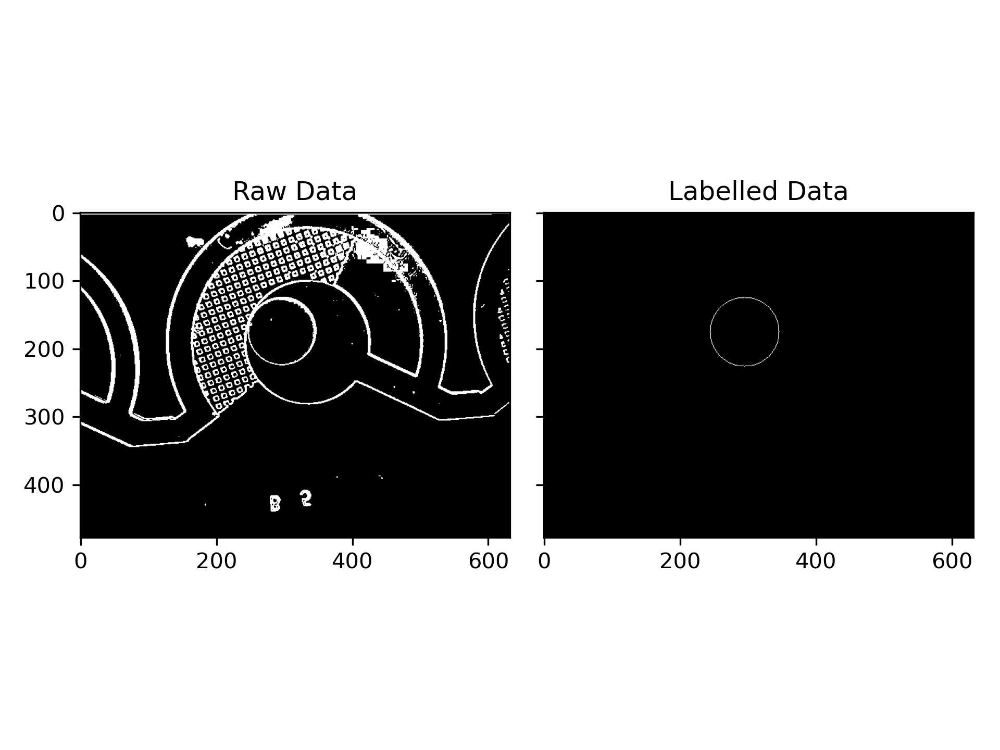

# Droplet Detection with Neural Networks

Use a Convolutional Neural Network (CNN) built in TensorFlow and Keras to detect a droplet in an experimental data set.

The neural net consists of 3 layers, and for testing data shows reasonable results for 
test data as shown below:


The goal is to apply it to a biological sample and detect droplet formation. The droplet as imaged by a microscope 
looks like:


This a thresholding algorithm is applied and the droplet is labelled:



## Installation
1. Create the conda environment from file (for Mac M1)
```shell
conda env create --file conda-env-macm1.yml
```
3. Activate environment 
```shell
conda activate ml_droplet
```
4. Add environment to Jupyter kernel 
```shell
python -m ipykernel install --name=ml_droplet
```
5. Explore the Jupyterlab Notebooks
```shell
jupyter lab
```


### Export conda environment
```shell
conda env export --no-builds | grep -v "^prefix: " > conda-env.yml
```
