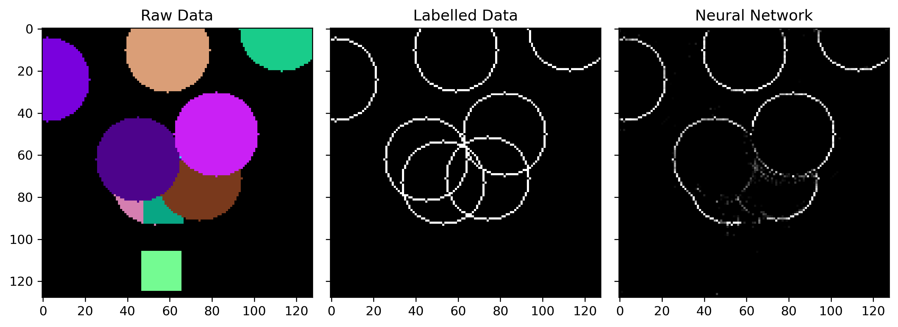

# Droplet Detection with Neural Networks

Use a Convolutional Neural Network built in TensorFlow and Keras to detect a droplet in an experimental data set.

## Test Data

The neural net consists of 4 layers, and for testing data shows reasonable results as shown below:



## Experimental Data

The goal is to apply it to a biological sample and detect droplet formation. The droplet as imaged by a microscope
looks like:


The model is trained on a subset of real data. The trained model is then used to find the droplet in the experimental
images.
An example of this is shown below:


**Note:** All biological droplet data is sourced from [@cfsb618](https://github.com/cfsb618)

## Model


## Installation

1. Create the conda environment from file (where `xx` is ether `win10` or `macm1`)

```shell
conda env create --file conda-env-xx.yml
```

3. Activate environment

```shell
conda activate ml_droplet
```

4. Add environment to Jupyter kernel

```shell
python -m ipykernel install --user --name=ml_droplet
```

### Performance

For optimal performance use a CUDA compatible NVIDIA GPU with the cuDNN libraries. The training times are around 3
orders of magnitude shorter.
A guide on how to do this is given in the [Tensorflow docs](https://www.tensorflow.org/install/gpu).

On Apple Silicon, use the `tensorflow-metal` plugin. A guide on how to do this is given in
the [Apple developer docs](https://developer.apple.com/metal/tensorflow-plugin/).

## Usage

1. Place your training data in `training_data/` and the corresponding droplet labels in `droplet_labels.py`
2. Train the model

```shell
python neural_network_training.py
```

4. This will train the neural network model and save the resulting model in `models/droplet_detection_model`
5. Test the model by running an automated test set

```shell
python plot_results.py
``` 

OR manually using the JupyterLab Notebook

```shell 
jupyter lab DropletDetectionTesting.ipynb
```

## TODO

- [x] Add automated hyperparameter optimization.
- [ ] Add droplet feature detection, such as detecting the point of phase separation
- [ ] Add random sampling for training and testing data (example code below)

### Export conda environment

```shell
conda env export --no-builds | grep -v "^prefix: " > conda-env.yml
```
