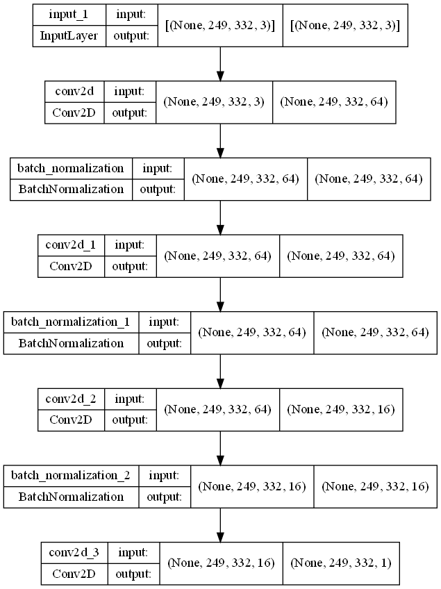

# Droplet Detection with Neural Networks

Use a Convolutional Neural Network built in TensorFlow and Keras to detect a droplet in an experimental data set.

## Test Data
The neural net consists of 4 layers, and for testing data shows reasonable results as shown below:


## Experimental Data
The goal is to apply it to a biological sample and detect droplet formation. The droplet as imaged by a microscope 
looks like:


A thresholding algorithm is applied to the raw image and the droplet is labelled, the output of the trained network for real data looks like:


This training is performed for a sufficiently large set of microscope images, and the resulting trained model is then used on real data.

**Note:** All biological droplet data sourced from [@cfsb618](https://github.com/cfsb618)

## Model


## Installation
1. Create the conda environment from file (where `xx` is ether `win10` or `macm1`)
```shell
conda env create --file conda-env-xx.yml
```
3. Activate environment 
```shell
conda activate ml_droplet
```
4. Add environment to Jupyter kernel 
```shell
python -m ipykernel install --name=ml_droplet
```
5. Explore and test the Jupyterlab Notebooks
```shell
jupyter lab
```

## Usage
1. Place your training data in `training_data/` and the corresponding droplet labels in `droplet_labels.py`
2. Run `neural_network_training.py`
3. This will train the neural network model and save the resulting model in `models/droplet_detection_model`
4. Test the model by running an automated test set `plot_results.py` or manually using `DropletDetectionTesting.ipynb`

### Export conda environment
```shell
conda env export --no-builds | grep -v "^prefix: " > conda-env.yml
```
